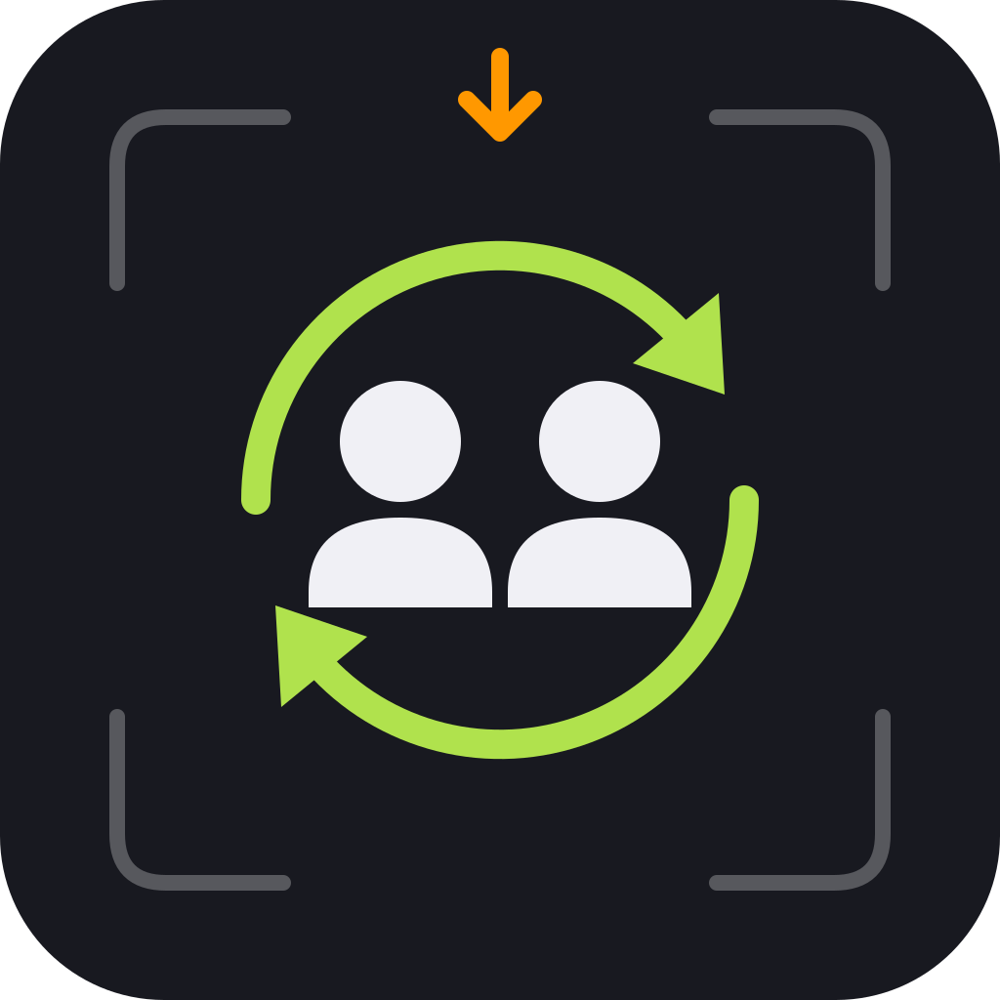

<p align="center"></p>

# s&box Collaborator – server

A self-hosted server that makes a small s&box team's coding agents (Claude Code, Codex, Cursor,
OpenCode, any MCP client) and s&box editors work like one team: who's doing what, tasks, file
reservations, API changes, handoffs, build results and "what changed while you were away" –
with GitHub as the source of truth. Pairs with the
[Collaborator s&box library](https://github.com/zeljkovranjes/sbox-collaborator).

## Setup (about 15 minutes)

You need: a small Linux server with Docker (1 GB RAM is plenty), a domain name pointing at it
(e.g. `mcp.example.com`), and a GitHub account.

**1. Get the code and create your settings file**

```sh
git clone https://github.com/zeljkovranjes/sbox-collaborator-server.git
cd sbox-collaborator-server
cp .env.example .env
```

**2. Fill in `.env`** (open it in any editor)

| setting | what to put |
|---|---|
| `PUBLIC_URL` | `https://mcp.example.com` (your domain) |
| `COLLAB_DOMAIN` | `mcp.example.com` |
| `SECRET_KEY` | run `openssl rand -hex 32` and paste the result |
| `POSTGRES_PASSWORD` | run `openssl rand -hex 24` and paste the result |
| `ADMIN_GITHUB_LOGINS` | your GitHub username (you become the admin) |

**3. Create a GitHub login app** – GitHub ▸ Settings ▸ Developer settings ▸ OAuth Apps ▸
*New OAuth App*:
- Homepage URL: `https://mcp.example.com`
- Authorization callback URL: `https://mcp.example.com/auth/github/callback`

Copy the *Client ID* and a new *Client secret* into `GITHUB_OAUTH_CLIENT_ID` and
`GITHUB_OAUTH_CLIENT_SECRET` in `.env`.

**4. Start it** (HTTPS certificates are set up automatically):

```sh
docker compose --profile caddy up -d --build
```

Open `https://mcp.example.com`, click *I already have an account ▸ Continue with GitHub*. You're
the admin.

**5. Create your project** – *Server admin ▸ Project*: a name and your GitHub repo (`you/my-game`).

**6. Invite your teammate** – *Server admin ▸ Invite teammate*, enter their GitHub username. Send
them the **server address** and the **server key** it shows (privately, it's single use).

**7. Connect your coding agents** – avatar menu ▸ *Connect agents & keys* ▸ *New access key*,
then copy the ready-made setup for Claude Code, Codex, Cursor or OpenCode shown on that page.
Add [clients/AGENTS.md](clients/AGENTS.md) to your game repo's `CLAUDE.md` / `AGENTS.md` so the
agents follow the team workflow.

Done. Your teammate joins from the s&box editor (View ▸ Collaborator) or the website with the
address + server key + GitHub login.

## Optional extras

| want | how |
|---|---|
| commits, pull requests and issues show up live | [GitHub webhook](docs/github-webhooks.md) + `GITHUB_TOKEN` and `GITHUB_WEBHOOK_SECRET` in `.env` |
| Discord pings for blockers, broken builds, handoffs, messages | paste a Discord webhook URL in *Project ▸ Discord notifications* ([details](docs/notifications.md)) |
| warn/block commits that touch a teammate's reserved files | the [git hook](docs/git-hooks.md) |
| nightly backups | `./scripts/backup.sh` in cron ([details](docs/deployment.md#backups)) |

Updating later: `git pull && docker compose --profile caddy up -d --build`.

## What's inside

- **For agents (MCP, 64 tools):** start-of-work context sync, catch-up, atomic task claiming,
  file/asset reservations, handoffs with notes, change announcements (API and breaking changes),
  decisions, knowledge, messages, build/test results, file history, GitHub and s&box asset tools.
- **Dashboard:** who's online and doing what, tasks, reservations, assets, git, decisions,
  knowledge, messages, activity, weekly digest.
- **Security:** GitHub login plus single-use server keys to join, per-device access keys
  (read-only possible, revocable), nothing secret stored in plain text. See [docs/security.md](docs/security.md).

## Documentation

[Deployment](docs/deployment.md) · [Configuration](docs/configuration.md) ·
[MCP tools](docs/mcp-tools.md) · [HTTP API](docs/http-api.md) ·
[Developer workflow](docs/developer-workflow.md) · [GitHub webhooks](docs/github-webhooks.md) ·
[Git hook](docs/git-hooks.md) · [Discord & digests](docs/notifications.md) ·
[Security](docs/security.md) · [Database](docs/database.md) · [Client setup](clients/README.md)

## Development

```sh
npm install
SECRET_KEY=$(openssl rand -hex 32) npm run dev   # http://localhost:8080, SQLite
npm run dev:web                                 # dashboard with hot reload
npm test                                        # SQLite + PostgreSQL test suites
```

## License

MIT
